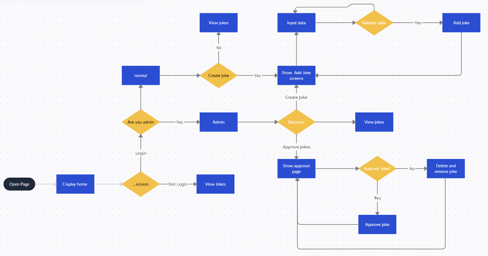
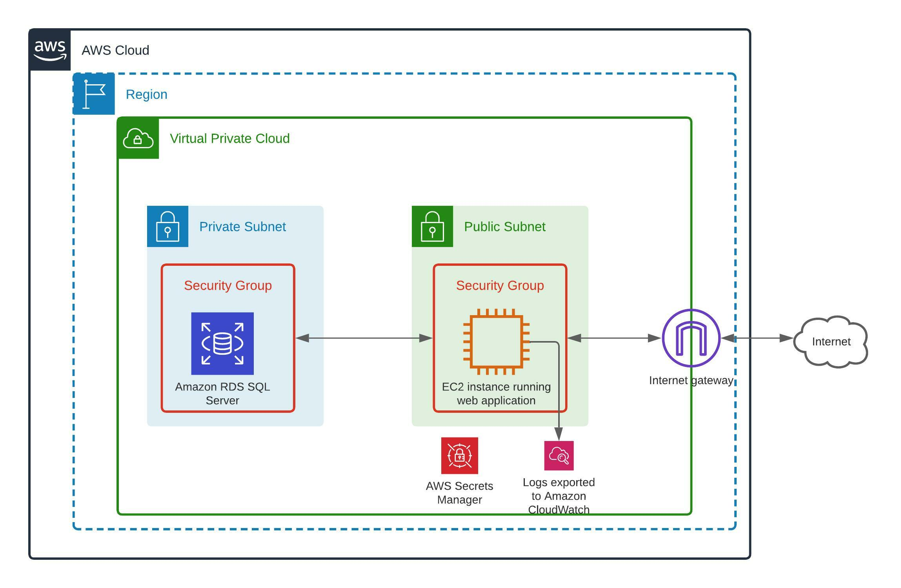

# Loadshedding Jokes

<!-- ABOUT THE PROJECT -->
## About The Project
A simple web application which allows users to view and post jokes.Any user who visits the website is able to view the jokes. To post jokes users will have to be authenticated. Authentication is done through Auth0 provider.
Users have the option to sign themselves up and confirm their email address.Please not that BBD emails fail to be verified (We are not sure why). Multifacotr authntication is enforced
and users have to enter and OTP when they login. Once users have authenticated, they are able to created jokes, please note that
newly created jokes only become visible after they have been approved by an administrator.
Designated admin users can navigate to the approve jokes page where they can accept/reject jokes. See image below for more information.

## Very important
If you require an admin user for testing purposes, please contact on the team members for assistance
 
<!-- GETTING STARTED -->
## Deployment
The application is hosted on an AWS EC2 instance. See image below for more details

 

### Built With

* .NET 6
* SQL Server
* AWS CloudWatch
* AWS SecretsManager
* Auth0

<!-- GETTING STARTED -->
## Deployment
The application is hosted on an AWS EC2 instance. See image below for more details

 - the hosted application can be found at the following url : https://www.loadshedding-jokes.online/

 

#### Running the application locally:

To run the application locally, the Auth0 domain and client id must be modified to point to the Auth0 dev account,please see new values below

"Domain": "dev-3lgejmsa.us.auth0.com",
"ClientId": "Y3zB6xGFNw9sQrl7oV8JqrapzB5Qladm"

The application can then be run by executing dotnet run

<!-- MEET THE TEAM -->
## Development Team

- [ ] [Razeen Bahadoor]()
- [ ] [Mothupi Ramogayana]()
- [ ] [Jacus Horn]()
- [ ] [Brandon Scott]()
- [ ] [Brent Stroberg]()

